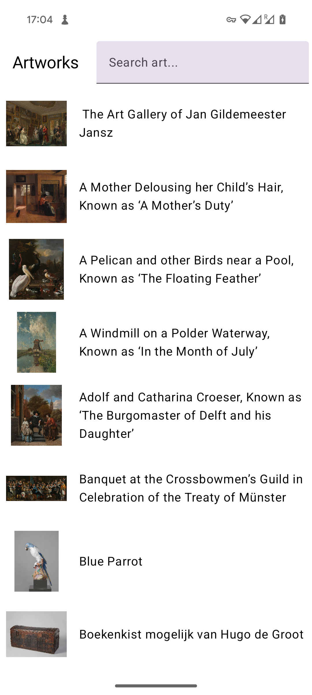
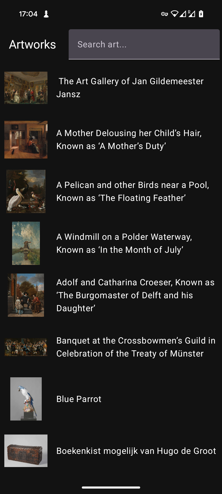
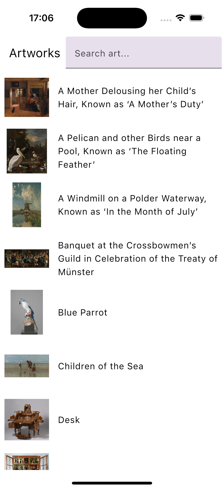
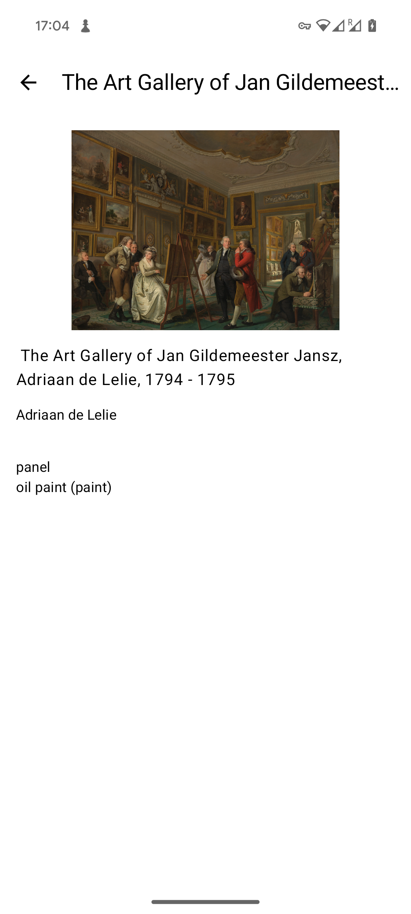
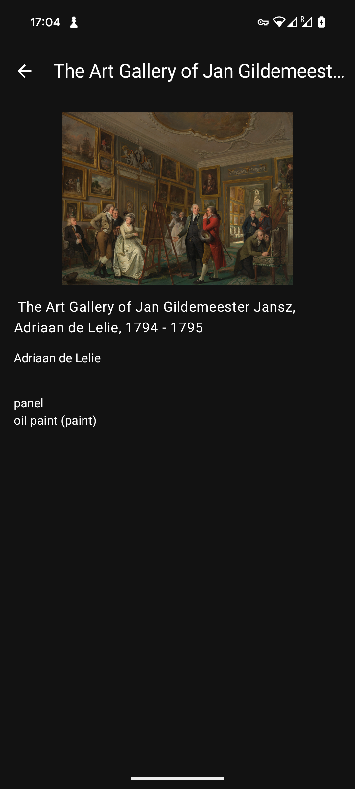
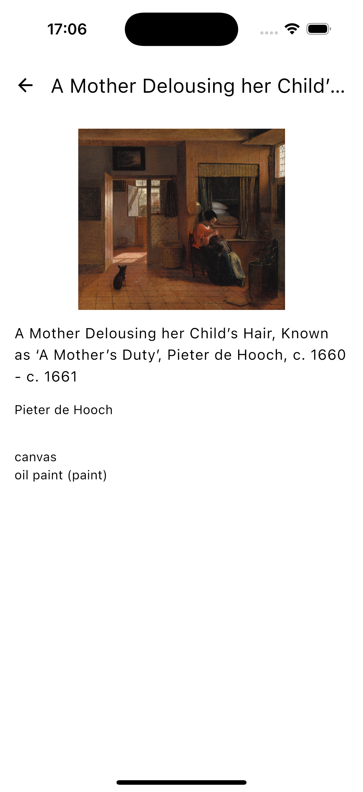

---

# Art KMP Test App

## Overview

The Art app KMP Demo is a Kotlin Multiplatform (KMP) project designed to showcase the capabilities of modern cross-platform development. This app fetches data from an API, saves it locally, provides search functionality, and allows users to view detailed information about selected Exhibits.

## Features

- **Fetch Data from API**: Retrieve Collection and  data from a remote API.
- **Local Storage**: Save fetched data locally for offline access.
- **View Details**: Detailed information about each Exhibit.

## Screenshots

### List Screen

| Light Theme                                             | Dark Theme                                            | iOS                                                 |
|---------------------------------------------------------|-------------------------------------------------------|-----------------------------------------------------|
|  |  |  |

### Details Screen

| Light Theme                                                  | Dark Theme                                                 | iOS                                                      |
|--------------------------------------------------------------|------------------------------------------------------------|----------------------------------------------------------|
|  |  |  |

## Technologies and Libraries

- **Kotlin Multiplatform**: Share code between Android and iOS.
- **Compose Multiplatform**: Build native UI for multiple platforms.
- **Modularization**: Organized codebase into modules for better scalability and maintainability.

- **Compose Navigation**: To handle the Nav Tree.
- **Ktor**: Networking library for API calls.
- **Room**: Local database for storing data.
- **Coil**: Library for image loading and caching.
- **Koin DI**: Dependency injection for managing dependencies.
- **Napier**: For cross-platform logging.

## Getting Started

### Prerequisites

- [Android Studio](https://developer.android.com/studio)
- [Xcode](https://developer.apple.com/xcode/) (for iOS development)
- [Kotlin Multiplatform Mobile Plugin](https://kotlinlang.org/docs/multiplatform-mobile-getting-started.html#install-the-kotlin-multiplatform-mobile-plugin)

### Setup

- get an API key at https://data.rijksmuseum.nl/docs/api/#access-to-apis
- Put that api kee in [API_KEY_HERE] in the `network` module

---